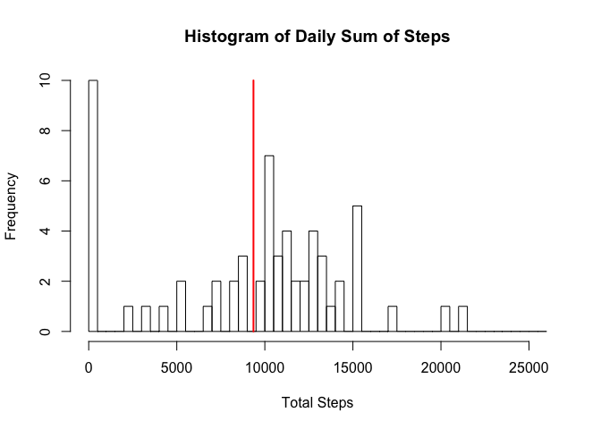
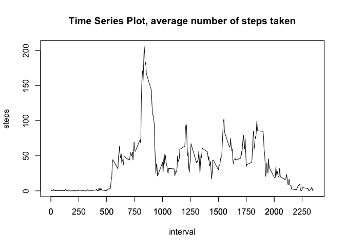
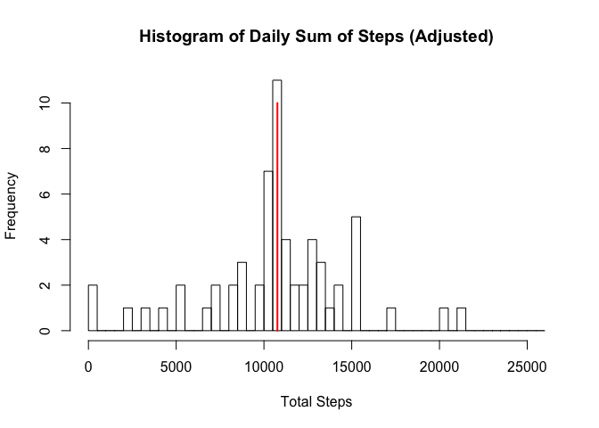
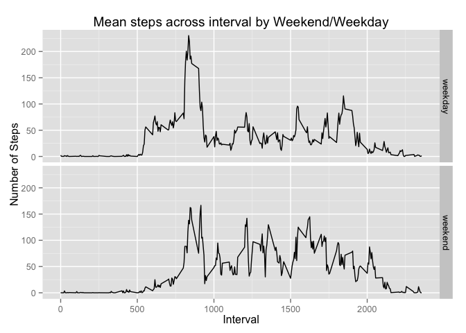

# Reproducible Research: Peer Assessment 1
Gaurav Garg (gaurav_garg@yahoo.com)  


## Loading and pre-processing the data
*Q1. Load the data (i.e. read.csv())*   
Instead of setting the working directory through code, I prefer to let the user set the working directory (outside the script). Assuming the input **data file "activity.csv"** is located in the **current working directory**.    
- Use read.csv() to read the data file. The data file has the header already. I will use the existing column names.  

*Q2. Process/transform the data (if necessary) into a format suitable for your analysis*  
2. I use melt(), in the reshape package, to create a molten data frame and use it across the assignment. I assign the date and the interval as id columns; steps become the variable. This allows me to group the data on date and/or interval, as I proceed through the assignment.    
3. To calculate the daily sum of steps, I use dcast() to create a data frame from the model data grouped on date. I pass the parameter na.rm=TRUE to get rid of incomplete rows.     

```r
        data_pa <- read.csv("activity.csv", header= TRUE)   
        require(dplyr)
```

```
## Loading required package: dplyr
## 
## Attaching package: 'dplyr'
## 
## The following object is masked from 'package:stats':
## 
##     filter
## 
## The following objects are masked from 'package:base':
## 
##     intersect, setdiff, setequal, union
```

```r
        require(reshape2)
```

```
## Loading required package: reshape2
```

```r
        data_pa_melt<-melt(data_pa,id=c("date","interval"), value.var = "steps")
        daily_steps<-dcast(data_pa_melt,date~variable,sum, drop = TRUE, na.rm=TRUE)
```

## What is mean total number of steps taken per day?
*Q1. Make a histogram of the total number of steps taken each day*  
In order to create the histogram, I create the breaks in increment of 500 steps. Here are the steps:  
- Find the maximum number of steps in the data frame, round it up to next 1000 and extend the scale to the right tail.   
- Use the seq() from 0 to upper limit calculated before.  
- Use the hist() function to plot a histogram of Total Number of Steps on daily basis with breaks = 500 instead of the default breaks.  
- I calculate the mean across the days and draw a line through the mean on the histogram.   
- Finally, I save a copy of plot in figures/ directory.  

```r
        steps_breaks <- seq (from=0, 
                     to = (round(max(daily_complete$steps),-3)+5000),
                     by = 500)
        hist(daily_steps$steps, main = "Histogram of Daily Sum of Steps", xlab = "Total Steps", 
                breaks = steps_breaks)
        xmean <- mean(daily_steps$steps)
        xmedian <- median(daily_steps$steps)
        lines(c(xmean , xmean),c(0,10), col = "red", lwd = 2)
```

 

```r
        #save the plot to the figures directory
        dev.copy(png,filename="./figures/pa1_figure1.png")
```

```
## quartz_off_screen 
##                 3
```

```r
        dev.off()
```

```
## quartz_off_screen 
##                 2
```
*Q2. Calculate and report the mean and median total number of steps taken per day*  
I am using the inline text computation to print the result of xmean and xmedian calculated in the previous R code chunk. The mean total number of steps taken per day is **9354** and the **median**  is **10395**. 

## What is the average daily activity pattern?
*Q1. Make a time series plot (i.e. type = "l") of the 5-minute interval (x-axis) and the average number of steps taken, averaged across all days (y-axis)*  
In order to show the daily activity pattern, we are building a time series plot. The steps needed to build the plot are summarized below:  
1. I use dcast() on interval and pass na.rm=TRUE to ignore incomplete rows.  
2. Calculate the tick marks for the time series.  
3. Add the interval as a new column and convert the result into a data frame.  
4. Create a line plot using base plot function.  

```r
        steps_by_interval <- dcast(data_pa_melt, interval~variable, fun.aggregate = mean, 
                                   na.rm=TRUE, order_by=interval)
        x_ticks <- seq(from = 0, to = 2500, by = 250)
        with(steps_by_interval,plot(interval, steps, type='l'))
        title(main="Time Series Plot, average number of steps taken")
        axis(1, at=x_ticks)
```

 

```r
        dev.copy(png,filename="./figures/PA1_figure2.png")
```

```
## quartz_off_screen 
##                 3
```

```r
        dev.off()
```

```
## quartz_off_screen 
##                 2
```

*Q2. Which 5-minute interval, on average across all the days in the dataset, contains the maximum number of steps?*  
To identify the 5-minute interval, containing the maximum average across all the days in the dataset, I use which.max() to identify the row and subset the data frame. Ignoring the incomplete rows, interval 835 has the highest average steps with 206 steps.  *I am using the inline text computation to print the results in this question*

```r
  steps_by_interval[which.max(steps_by_interval$steps),]
```

```
##     interval    steps
## 104      835 206.1698
```
## Imputing missing values
There are four parts of this section.  
*Q1. Calculate and report the total number of missing values in the dataset (i.e. the total number of rows with NAs)*  
In order to count the number of rows with incomplete data, I use the count() in conjuction with completed.cases(). Substract the complete cases from the total row count.     

```r
  incomplete <- count(data_pa) - sum(complete.cases(data_pa))
```
I am using the inline text computation to print the result of incomplete calculated in the previous R code chunk. There are **17568** rows in the original dataset. Out of which **2304** rows are with NAs.  

*Q2. Devise a strategy for filling in all of the missing values in the dataset. The strategy does not need to be sophisticated. For example, you could use the mean/median for that day, or the mean for that 5-minute interval, etc.*  
I am using the interval means calculated in the previous section to replace all the missing values. The steps are detailed in the Q3.

*Q3. Create a new dataset that is equal to the original dataset but with the missing data filled in.*   
The steps to complete Q2 and Q3 are highlighted below.  
- First subset the original data into two seperate data sets using complete.cases()  
- Using the merge(), I merge the incomplete dataset with the means calculated for each interval. This will result in four columns: orignal steps with NA and a new column with interval mean. Before storing the resultant data set, I drop the column with NAs and rename the new column as 'steps'.   
- Finally, I use rbind() to create a complete data set by combining the complete cases and the new version of the rows filled with interval means.


```r
        data_pa.complete <- data_pa[complete.cases(data_pa),] # subset and get the complete records
        data_pa.incomplete <- data_pa[!complete.cases(data_pa),] #subset and get the incomplete records
        data_pa.incomplete2 <-merge(data_pa.incomplete,steps_by_interval, 
                                    by = 'interval')[,-2] #merge with interval means and drop x.steps
        colnames(data_pa.incomplete2)[3] <-"steps" # rename the new column
        data_pa2 <- rbind(data_pa.complete, data_pa.incomplete2)# create a new data frame
        incomplete2 <- count(data_pa2) - sum(complete.cases(data_pa2))
```
There are **17568** rows in the new dataset. Out of which **0** rows are with NAs.  

*Q4. Make a histogram of the total number of steps taken each day and Calculate and report the mean and median total number of steps taken per day. Do these values differ from the estimates from the first part of the assignment? What is the impact of imputing missing data on the estimates of the total daily number of steps?*  
I am repeating the steps to build the histogram with the new dataset. I am also calculating the new mean and median in the R code chunk below.

```r
        data_pa_melt2<-melt(data_pa2,id=c("date","interval"), value.var = "steps")
        daily_steps2<-dcast(data_pa_melt2,date~variable,sum, drop = TRUE, na.rm=TRUE)
        hist(daily_steps2$steps, main = "Histogram of Daily Sum of Steps (Adjusted)", xlab = "Total Steps", 
                breaks = steps_breaks)
        xmean2 <- mean(daily_steps2$steps)
        xmedian2 <- median(daily_steps2$steps)
        lines(c(xmean2 , xmean2),c(0,10), col = "red", lwd = 2)
```

 

```r
        #save the plot to the figures directory
        dev.copy(png,filename="./figures/pa1_figure3.png")
```

```
## quartz_off_screen 
##                 3
```

```r
        dev.off()
```

```
## quartz_off_screen 
##                 2
```
I am using the inline text computation to print the result of xmean and xmedian calculated in the previous R code chunk. The **new mean** total number of steps taken per day is **10766**, compared to the original **9354**. The **new median**  is **10766** as compared to the **10395**. One of the impact of adjusting the rows with interval means is that that the **daily mean has shifted to the interval where the highest activity**.

## Are there differences in activity patterns between weekdays and weekends?
*Q1. Create a new factor variable in the dataset with two levels – “weekday” and “weekend” indicating whether a given date is a weekday or weekend day.*  
I am using a combination of ifelse() with weekdays() and then converting to factor. The new column is call **weekend**. Using the summary() to show the distribution of rows into weekdays and weekend. *Actual panel graphs are shown in the next section.*  

```r
        data_pa2$weekday = factor(ifelse(weekdays(as.Date(data_pa2$date)) %in% 
                                         c("Saturday","Sunday"), "weekend", "weekday"))
        summary(data_pa2)
```

```
##      steps                date          interval         weekday     
##  Min.   :  0.00   2012-10-01:  288   Min.   :   0.0   weekday:12960  
##  1st Qu.:  0.00   2012-10-02:  288   1st Qu.: 588.8   weekend: 4608  
##  Median :  0.00   2012-10-03:  288   Median :1177.5                  
##  Mean   : 37.38   2012-10-04:  288   Mean   :1177.5                  
##  3rd Qu.: 27.00   2012-10-05:  288   3rd Qu.:1766.2                  
##  Max.   :806.00   2012-10-06:  288   Max.   :2355.0                  
##                   (Other)   :15840
```

*Q2. Make a panel plot containing a time series plot (i.e. type = "l") of the 5-minute interval (x-axis) and the average number of steps taken, averaged across all weekday days or weekend days (y-axis).*  
I am using the qplot() in ggplot2 package. The steps for producing the solution are highlighted below:  
- I melt the complete dataset created in the previous section with id = date, interval and (new factor) weekday. Steps is the value variable.  
- Using dcast(), I create a new dataframe on weekend factor + interval on one dimension and the steps on the second dimension. Using mean, I calculate the mean for each interval, grouped by the factor weekday.  
- qplot() is used with x = interval, y = steps and facets = weekday. 
- using dev.copy() to store the plot under the figures directory and closing the file device.  

```r
        require(ggplot2) #using the ggplot2
```

```
## Loading required package: ggplot2
```

```r
        require(scales)
```

```
## Loading required package: scales
```

```r
        data_pa_melt2<-melt(data_pa2,id=c("date","interval","weekday"), value.var = "steps")
        steps_by_weekend2 <- dcast(data_pa_melt2, weekday+interval~variable, fun.aggregate = mean, 
                                   na.rm=TRUE, order_by=interval)
        # set margins
        op <- par(mar = c(5,10,4,2) + 0.1)
        # Use QPlot to plot and add asthetics
        qplot(interval, steps, data=steps_by_weekend2,  facets = weekday~., geom=c("line")) + 
        labs(x = "Interval", 
             title="Mean steps across interval by Weekend/Weekday", y = "Number of Steps")
```

 

```r
        dev.copy(png,filename="./figures/PA1_figure4.png")
```

```
## quartz_off_screen 
##                 3
```

```r
        dev.off()
```

```
## quartz_off_screen 
##                 2
```
